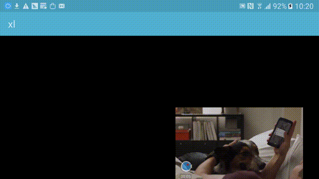

# XLPlayer

[iOS播放器SGPlayer传送门](https://github.com/libobjc/SGPlayer)

## 功能介绍
* XLPlayer除解封装(ffmpeg)和陀螺仪数据滤波(HeadTrecker)其他部分均使用Android原生api
* 默认情况下使用MediaCodec(Android 硬解)->SurfaceTexture->OpenGL ES工作模式,性能优异,小米3也可以轻松播放4K VR视频
* 支持各种流媒体和本地视频播放
* 支持几乎所有的媒体封装格式,包括但不限于.mp4 .mkv .flv rtmp hls .webm .mov等
* 支持音/视频播放,暂停,停止,seek,获取总时长,已播时长等播放器常用功能
* H263/H264/H265/MPEG4/VP8/VP9 支持硬件加速(部分设备不支持H265 VP9)
* 支持音频自适应最佳采样率播放
* 支持音视频变速(0.5 - 2.0)不变调播放
* 支持VR视频播放,VR视频模式动态切换(球模式、盒子模式、小行星模式、 建筑学模式、展开模式)
* 球模式、盒子模式、建筑学模式支持陀螺仪控制
* 盒子模式带有透镜畸变和色散的补偿
* 支持播放时动态切换surface
* 支持动态切换画面方向
* 支持后台播放
* 支持获取已缓存时长,当前帧率,当前下载速度
* 支持视频本身自带rotation的旋转
* 支持强制软解(默认自适应)
* 支持列表播放
* 支持设置缓存时长和大小

## 使用说明及注意事项请参考[release_v1.0](https://github.com/xl-player-developers/xl_player/tree/release_v1.0)

## v_2.0计划
* 1、由于现在Android机型的Ndk-abi版本已经非常统一，99%以上支持armeabi-v7a,所以在新版本中将去掉不必要的abi版本支持逻辑，简化项目结构。**（已完成）**
* 2、现有的缓存是指内存缓存，新版本有计划加入本地缓存逻辑，缓存的媒体格式包括但不限于普通流媒体，HLS，DASH。**（不确定什么时候有时间做，但是在计划内）**
* 3、单独分支做一个纯播放器，没有VR等功能单纯播放器，原因是当前master的版本由于需要VR等功能使得项目最终的体积较大。**（不确定什么时候有时间做，但是在计划内）**
* 4、音频播放加入aaudio。**（不确定什么时候有时间做，但是在计划内）**

## 新版本注意事项
   **新版本中只保留了armeabi-v7a，最低支持版本的api-16,默认不会调用jni中的mediandk，只会反射java中的mediacodec，但是调用AMediaCodec的逻辑被保存了下来，所以如果你的app版本minsdk >= 21，你可以通过将[build.gradle](xl-player-armv7a/build.gradle)中的minSdkVersion和targetSdkVersion改为21+来启用这部分逻辑。**

## 例图

## 联系方式:
交流QQ群     550224107

瘦子      QQ:372127449

晓龙同学   QQ:371575229
